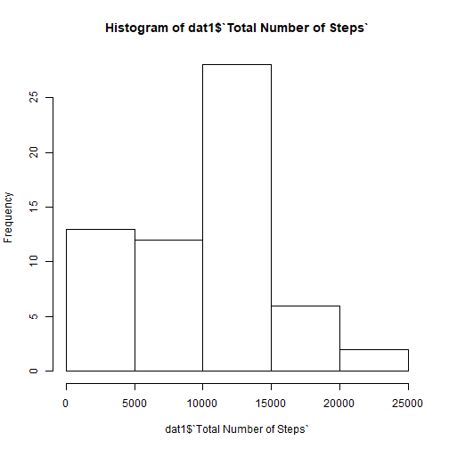
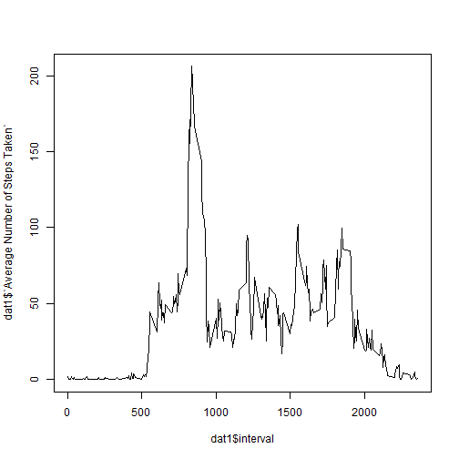
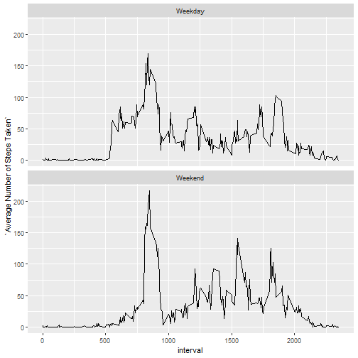

## Loading and preprocessing the data   
In addition to the data also loading packages that will be used; namely: *dplyr,ggplot,lubridate*.  


```r
pckgs <- c("dplyr","ggplot2","lubridate","xtable")
sapply(pckgs, require, character.only = TRUE)
```

    dplyr   ggplot2 lubridate    xtable 
     TRUE      TRUE      TRUE      TRUE 

```r
unzip("activity.zip")
dat <- read.csv("activity.csv",header = TRUE,stringsAsFactors = FALSE,na.strings = "NA")
tb <- xtable(dat[1:10,])
dat$date <- as_date(dat$date)
print(tb,type = "html")
```

<!-- html table generated in R 3.6.0 by xtable 1.8-4 package -->
<!-- Tue Sep 24 10:35:14 2019 -->
<table border=1>
<tr> <th>  </th> <th> steps </th> <th> date </th> <th> interval </th>  </tr>
  <tr> <td align="right"> 1 </td> <td align="right">  </td> <td> 2012-10-01 </td> <td align="right">   0 </td> </tr>
  <tr> <td align="right"> 2 </td> <td align="right">  </td> <td> 2012-10-01 </td> <td align="right">   5 </td> </tr>
  <tr> <td align="right"> 3 </td> <td align="right">  </td> <td> 2012-10-01 </td> <td align="right">  10 </td> </tr>
  <tr> <td align="right"> 4 </td> <td align="right">  </td> <td> 2012-10-01 </td> <td align="right">  15 </td> </tr>
  <tr> <td align="right"> 5 </td> <td align="right">  </td> <td> 2012-10-01 </td> <td align="right">  20 </td> </tr>
  <tr> <td align="right"> 6 </td> <td align="right">  </td> <td> 2012-10-01 </td> <td align="right">  25 </td> </tr>
  <tr> <td align="right"> 7 </td> <td align="right">  </td> <td> 2012-10-01 </td> <td align="right">  30 </td> </tr>
  <tr> <td align="right"> 8 </td> <td align="right">  </td> <td> 2012-10-01 </td> <td align="right">  35 </td> </tr>
  <tr> <td align="right"> 9 </td> <td align="right">  </td> <td> 2012-10-01 </td> <td align="right">  40 </td> </tr>
  <tr> <td align="right"> 10 </td> <td align="right">  </td> <td> 2012-10-01 </td> <td align="right">  45 </td> </tr>
   </table>
  
## What is mean total number of steps taken per day?  
### Make a histogram of the total number of steps taken each day  

```r
dat1 <- dat %>%
        group_by(date)%>%
            summarise("Total Number of Steps" = sum(steps,na.rm = TRUE))
x = round(mean(dat1$`Total Number of Steps`,na.rm = TRUE),digits = 1)
y = median(dat1$`Total Number of Steps`,na.rm = TRUE)
hist(dat1$`Total Number of Steps`)
```




### Calculate and report the mean and median total number of steps taken per day  

The mean number of total steps taken per day = 9354.2 and the median number of total steps taken per day = 10395.  

## What is the average daily activity pattern?  

### Make a time series plot (i.e. type = "l") of the 5-minute interval (x-axis)and the average number of steps taken, averaged across all days (y-axis)  


```r
dat1 <- dat %>% 
  group_by(interval) %>% 
    summarise("Average Number of Steps Taken" = mean(steps,na.rm = TRUE))
plot(x = dat1$interval,y = dat1$`Average Number of Steps Taken`,type = "l")
```



```r
k <- dat1$interval [which.max(dat1$`Average Number of Steps Taken`)]
l <- k - 5
```

### Which 5-minute interval,on average across all the days in the dataset,contains the maximum number of steps?  

The five minute interval between 830 and 835 has the maximum number of total steps taken across all days.

## Imputing missing values

### Calculate and report the total number of missing values in the dataset.  

```r
 a<- sum(!complete.cases(dat))
```

There are 2304 missing values in this dataset.

### Devise a strategy for filling in all of the missing values in the dataset.  
There can be a number of strategies to impute the missing values:  
1. **Replace with Median Number of steps for the day:**  However, this will not be appropriate as activity levels vary substantially with the time of the day.  
2. **Replace with Median Number of steps for the interval:**  

```r
dat <- dat %>%
  group_by(interval) %>%
    mutate(steps = ifelse(is.na(steps),
              median(steps,na.rm = TRUE),steps))
```

### Make a histogram of the total number of steps taken each day and Calculate
and report the mean and median total number of steps taken per day. Report the change in these values due to imputation of missing values.


```r
dat1 <- dat %>%
        group_by(date)%>%
            summarise("Total Number of Steps" = sum(steps))
x1 = round(mean(dat1$`Total Number of Steps`),digits = 1)
y1 = median(dat1$`Total Number of Steps`)
hist(dat1$`Total Number of Steps`)
```


We can see that the mean has changed from 9354.2 to 9503.9 and the median has changed from 10395 to 10395 after imputation of missing values.  

## Are there differences in activity patterns between weekdays and weekends?


```r
dat$wday <- wday(dat$date)
dat$day <- ifelse(dat$wday < 5,"Weekday","Weekend")
dat1 <- dat %>% 
  group_by(interval,day) %>% 
    summarise("Average Number of Steps Taken" = mean(steps,na.rm = TRUE))
dat1 %>%
  ggplot(aes(x=interval,y=`Average Number of Steps Taken`))+
    geom_line()+
      facet_wrap(facets = aes(dat1$day),ncol = 1)
```



```r
knitr::knit2html("PA1_template.Rmd",force_v1 = TRUE)
```

```
## 
## 
## processing file: PA1_template.Rmd
```

```
## Error in parse_block(g[-1], g[1], params.src): duplicate label 'loading'
```

